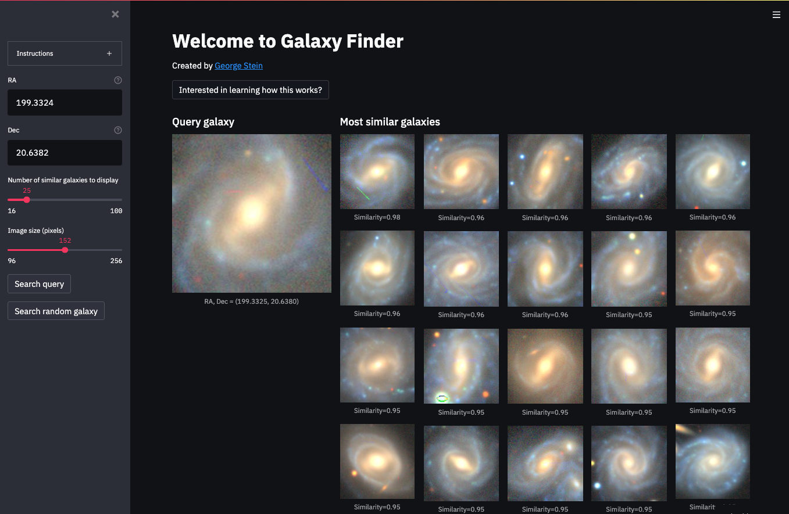

# Welcome to Galaxy Finder!

This is an interactive galaxy visualization app using the [streamlit library](https://docs.streamlit.io/en/stable/):

**Check out the live version [share.streamlit.io/georgestein/galaxy_search](https://share.streamlit.io/georgestein/galaxy_search/main/galaxy_search_app.py)**

1. You enter the coordinates of your favourite galaxy, or let it select a random one.
2. It searches for the most similar looking ones in the [DECaLS dr9 dataset](https://www.legacysurvey.org/viewer).
3. It displays the images and datatables, and gives download links.
4. A variety of options can be found in the sidebar.

---
  
### A bit about the method: 
- The `similarity' of two images is quite easy to judge by eye - but writing an algorithm to do the same is not as easy as one might think! This is because we can easily identify and understand what object is in the image.                     
- A machine is different - it simply looks individual pixel values. Yet two images that to us have very similar properties and appearences will likely have vastly different pixel values. For example, imagine rotating a galaxy image by 90 degrees. It it obviously still the same galaxy, but the pixel values have completeley changed.                                       
- So we first need to teach a computer to understand what is actually in the image on a deeper level than just looking at pixel values.                                                                                                   
- To do this we used a type of machine learning called "self-supervised representation learning" to boil down each image into a concentrated vector of information, or `representation', that encapsulates the appearance and properties of the galaxy.
- For each galaxy image we create new versions by rotating it, adding noise, blurring it, etc., and we teach the machine to learn the same representation for all these versions of the same galaxy. In this way, we move beyond looking at pixel values, and teach the machine a deeper understanding of the image.
- Once we have trained the machine learning model on millions of galaxies we calculate and save the representation of every image. Then, you tell us what galaxy to use as a starting point, we find the representation belonging to the image of that galaxy, compare it to millions of other representations from all the other galaxies, and return the most similar images!

**Please see [our paper](https://arxiv.org/abs/2012.13083) or [website](https://portal.nersc.gov/project/dasrepo/self-supervised-learning-sdss/) for more details on the method.**

- Products here are just initial trials for fun. We are working hard to create better models!

What data we used:
- We used galaxy images from DECaLS DR9 https://www.legacysurvey.org/, randomly sampling 3.5 million galaxies to train the machine learning model. We then apply it on every galaxy in the dataset, about 42 million galaxies with z-band magnitude < 20, so most bright things in the sky should be included, with very dim and small objects likely missing - more to come soon!

Updates will come periodically as we add more data and train better models

Created by [George Stein](https://github.com/georgestein) 	    
